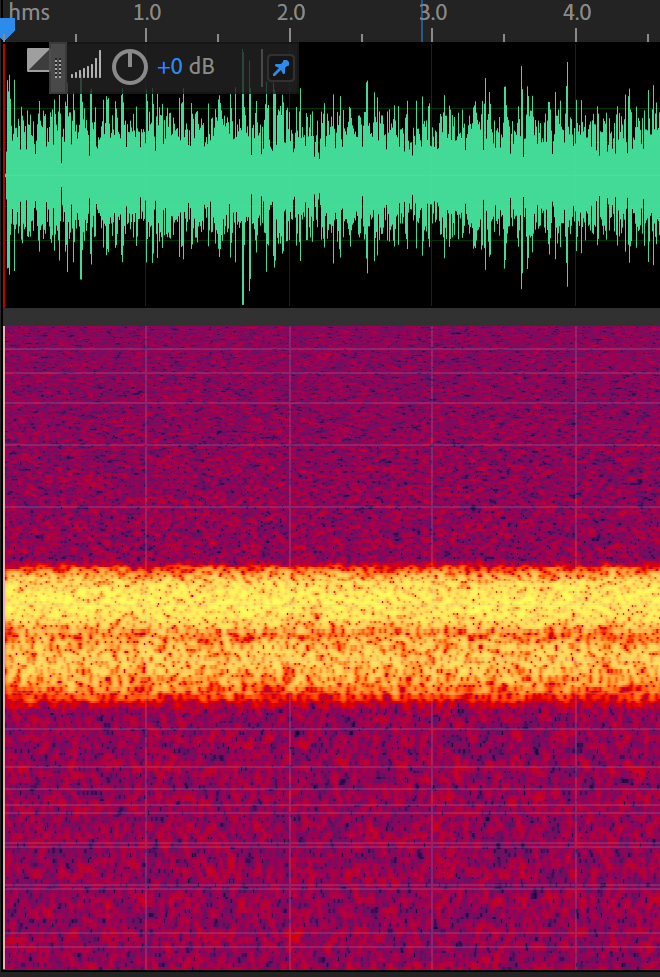
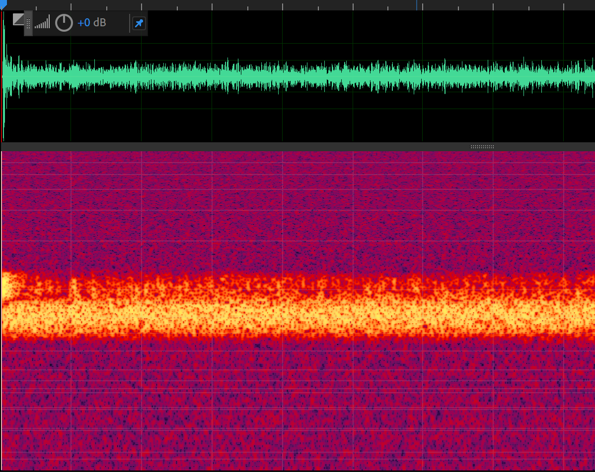
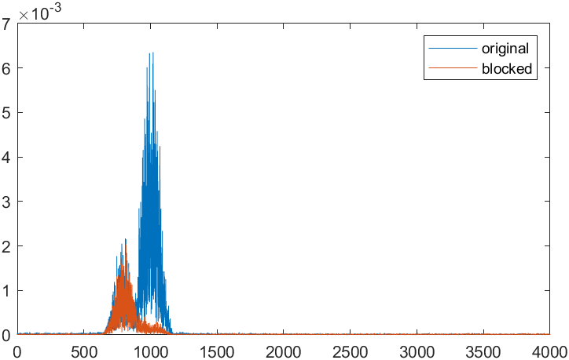
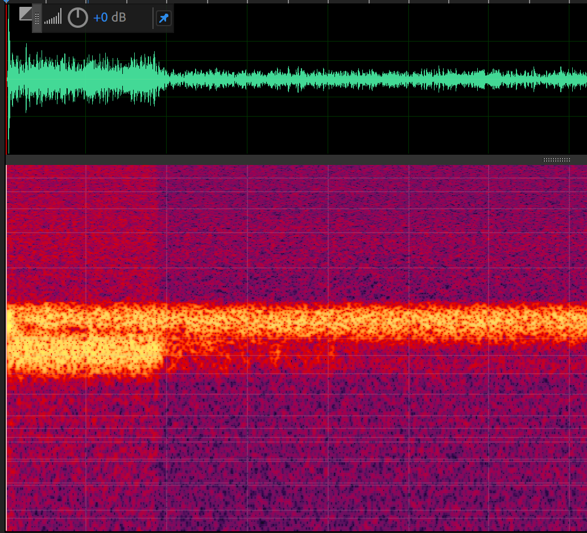
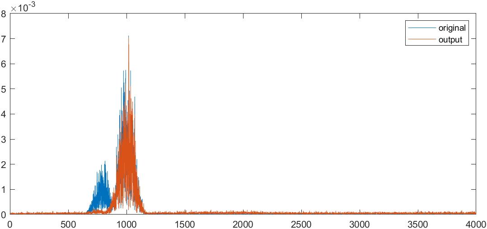
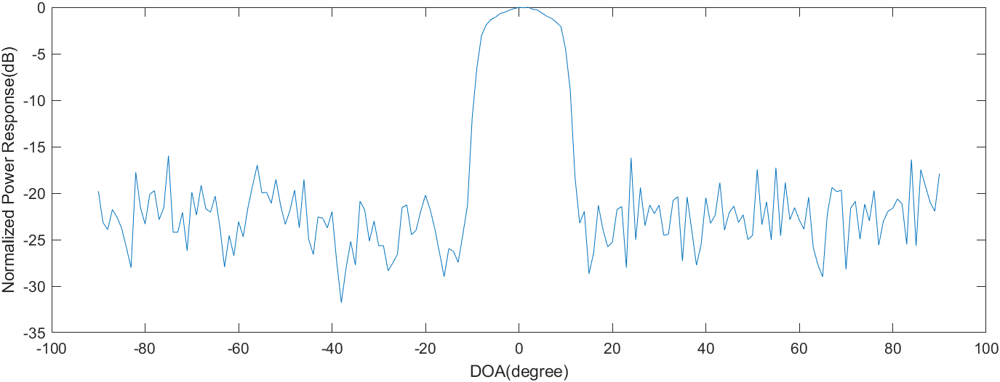

# Implementation of a robust GSC with CCAF and NCAF(Hoshuyama et. al., 1999)

A MATLAB implementation of the GSC in Verilog style. Use main.m to deploy the beamformer, use doatest.m to test the spatial response, use PowerInspection.m to inspect the narrowband power relationship.

I used [Pyroomacoustics](https://pypi.org/project/pyroomacoustics/) to generate a narrowband Gaussian test signal with a interference signal and white noise. The sampling rate was 8kHz, with the target signal source in the broadside and the interference source located at 53 degrees away. The target signal was in the frequency range of 960-1040Hz, while the interference was in the range of 760-840Hz (the spectrum of a channel of the test signal is as shown in the above figure). The Signal-to-Interference Ratio (SIR) was set to 10dB (it was mentioned in Hoshuyama's paper that a low SIR would lead to poor Beamforming (BM) performance, which was indeed the case in the actual experiment). Below is the output signal of the BM.

It can be seen that by 220ms, the Blocking Matrix(BM) has converged (approximately 600 rounds of parameter iteration), and the frequency band of the target signal is greatly weakened. From the spectral analysis of the signal after convergence, the power within the frequency band of the target signal significantly attenuates after passing through the blocking matrix, while the interference signal remains relatively unchanged. At this point, the power ratio between the interference signal and the target signal is approximately 16.6dB, with the target signal attenuated by 26dB. However, there is still leakage of the target signal.

The interference after blocking is processed through Multiple-input Canceller (MC) to obtain the enhanced output, as shown in the figure. The first abrupt change marks the end of BM iteration and the start of MC iteration. It can be observed that at this point, the interference signal begins to attenuate, and the background white noise significantly diminishes. Subsequently, after parameter updates in MC, the output signal almost eliminates the interference signal. From the power spectrum estimation, it is also evident that at this stage, the noise signal is nearly submerged in the background noise, with the power of the target signal remaining almost unchanged (acceptable target signal cancellation). The power ratio between the target signal and the interference signal is 27.7dB, with the interference signal attenuated by 19.5dB (corresponds to the original paper's results). This approach is relatively successful in scenarios involving simple narrowband signals and high Signal-to-Interference Ratios (SIR).

The spatial response of the beamformer. Generate a batch of test signals with target narrowband signal(centered 1000Hz) impinging from all directions, and measure the stable output signals' average power. The result shows that the passband is within $\pm10^\circ$, which proves the spatial robustness.

## REFERENCE

1. Hoshuyama, Osamu, Akihiko SUGIYAMA, and Akihiro HIRANO. "A robust adaptive beamformer with a blocking matrix using coefficient-constrained adaptive filters." *IEICE transactions on fundamentals of electronics, communications and computer sciences* 82.4 (1999): 640-647.
